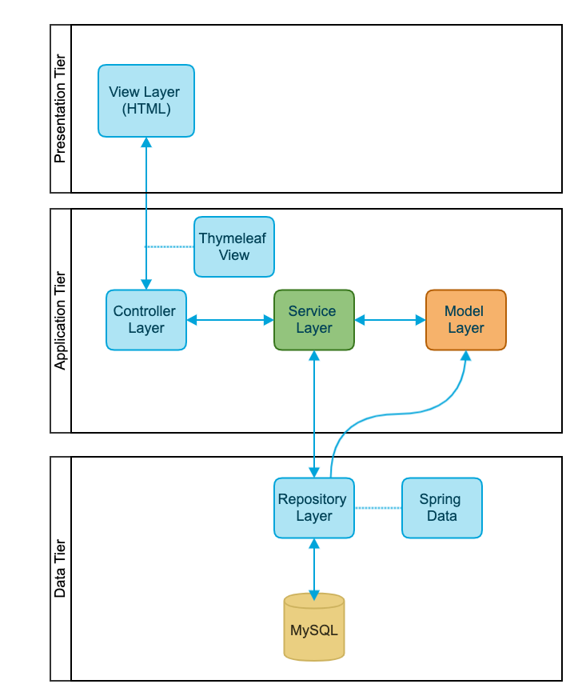

# PhoneBook #

This is a SpringBoot + Thymeleaf + MySQL webapp.  Packaged as a Jar file which can be executed on top of the JavaVirtualMachine.

# How to run? #

The PhoneBook app can be run in multiple ways:

### Java Application ###

Execute the app as a regular Java app (jdk1.8) with command 'java -jar'.  For this you must have an installation of MySQL with a
schema created.  The App itself will handle the creation of the table.

1. Clone the repo and build it with Apache Maven: ``` mvn clean install ```
2. Once maven generates the Jar file, then run the jar with following params:
```sh
java -Dphonebook_db_username=<<db_user>>
    -Dphonebook_db_password=<<db_password>>
    -Dphonebook_db_host=<<db_host>>
    -Dphonebook_db_port=<<db_port>>
    -Dphonebook_db_schema=<<db_schema>>
    -jar
    phone-book-0.0.1-SNAPSHOT.jar
```

### Docker ###

You can use Docker to build the image and run it as a container.

Using docker you will be able to set up a container which can be used in a kubernates environment.

1. build with
```sh
docker build -t --name=phone-book -e DB_USER=<<db_user>> DB_PASS=<<db_password>> DB_HOST=<<db_host>> 
DB_PORT=<<db_port>> DB_SCHEMA=<<db_schema>> .
```


### Docker compose ###

Using docker-compose command to start up the app (together with MySQL server container).  This way you dont need to have
your MySQL installation, but just having docker-compose installer will be enough.  docker-compose will setup everything for you.

Run:
```sh
docker-compose up -d
```

And let the magic happen.


### Architecture Definition ###

Considered as 3-tier architecture, being composed by: 1. Presentation tier + 2. Application tier + 3. Data tier.




### Application layers ###

At the same time, the application was splitted into multiple logical layer organized by packages inside the source
code: 

1. Controller Layer: Contains the methods that act as interceptor of client requests.
2. Service Layer: Contains the business logic.
3. Model Layer: Contains the classes representing the business concepts.
4. Repository Layer: Contains classes that allow to access persistent data.


